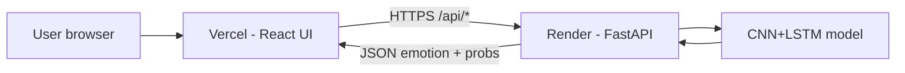
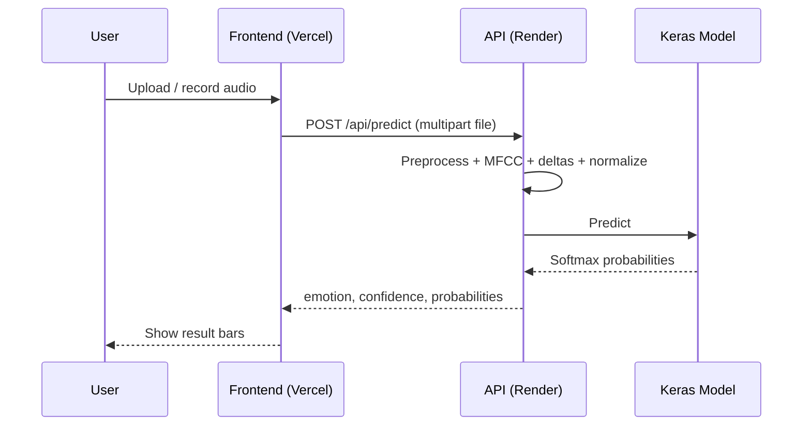
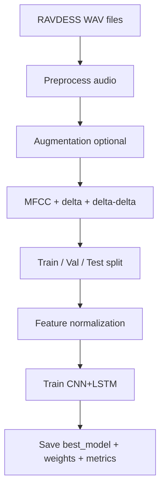

# Listenly

Speech Emotion Recognition system that predicts emotion from short audio clips.

**UI:** React (Vite) — two pages: **Home** and **Analyze**  
**API:** FastAPI + TensorFlow / Keras (CNN + LSTM)  
**Dataset:** RAVDESS (with augmentation)  
**Latest test accuracy:** ~95.7%

---

## Table of contents

1. [Overview](#1-overview)
2. [Architecture](#2-architecture)
3. [Project structure](#3-project-structure)
4. [How prediction works](#4-how-prediction-works)
5. [Model & training](#5-model--training)
6. [Local setup](#6-local-setup)
7. [API reference](#7-api-reference)
8. [Deployment](#8-deployment)
9. [Configuration](#9-configuration)
10. [Troubleshooting](#10-troubleshooting)

---

## 1. Overview

Listenly takes a speech audio file (or a microphone recording), extracts MFCC features (with deltas), and classifies it into one of eight emotions:

| Emotion | Emotion | Emotion | Emotion |
|---------|---------|---------|---------|
| neutral | calm | happy | sad |
| angry | fear | disgust | surprise |

The product UI has only two surfaces:

| Page | Purpose |
|------|---------|
| **Home** | Brand, short pitch, 3-step flow, CTA |
| **Analyze** | Upload / record audio → predict emotion + confidence bars |

---

## 2. Architecture

### System diagram



### Request flow



### Training pipeline



---

## 3. Project structure

```text
listenly/
├── api.py                 # FastAPI server
├── predict.py             # EmotionPredictor (load model + infer)
├── train.py               # Training pipeline
├── config.py              # Paths, labels, hyperparameters
├── labels.json            # Emotion label list
├── requirements.txt       # Full local deps
├── requirements-api.txt   # Lean production deps (Render)
├── render.yaml            # Render service config
├── runtime.txt            # Python 3.12 pin
├── models/
│   ├── cnn_lstm_model.py  # Primary architecture
│   ├── cnn_model.py
│   └── lstm_model.py
├── utils/
│   ├── audio_processing.py
│   ├── feature_extraction.py
│   ├── dataset_loader.py
│   └── visualization.py
├── saved_models/
│   ├── best_model_cnn_lstm.h5
│   ├── best_model_cnn_lstm.weights.h5
│   ├── feature_norm_cnn_lstm.npz
│   ├── metrics_cnn_lstm.json
│   └── *.png / report files
├── dataset/               # Local only (gitignored)
│   └── RAVDESS/
└── frontend/              # React + Vite app
    ├── src/App.jsx
    ├── vercel.json
    └── package.json
```

---

## 4. How prediction works

1. **Input** — `.wav` / `.mp3` / `.webm` / etc. (browser upload or mic).
2. **Preprocess** — resample to 22.05 kHz, mono, trim, pad/truncate to 3 seconds.
3. **Features** — 40 MFCCs + first/second deltas → shape `(40, time, 3)`.
4. **Normalize** — apply train-set mean/std from `feature_norm_cnn_lstm.npz`.
5. **Model** — CNN extracts local patterns; BiLSTM models time; softmax over 8 classes.
6. **Output** — top emotion, confidence, full probability vector.

---

## 5. Model & training

### Architecture (CNN + LSTM)

```text
Input (40 × T × 3)
  → Conv2D blocks + BatchNorm + MaxPool + Dropout
  → Reshape to time sequence
  → Bidirectional LSTM × 2
  → Dense → Softmax (8 emotions)
```

### Training improvements used

- Data augmentation (pitch / stretch / noise)
- MFCC deltas
- Feature normalization
- Class weights (helps rare classes like neutral)
- EarlyStopping on `val_accuracy`
- Checkpoint = best validation accuracy model

### Latest reported metrics

| Metric | Value |
|--------|-------|
| Test accuracy | ~95.7% |
| Best val accuracy | ~97.2% |
| Train / val / test (augmented) | 4608 / 576 / 576 |

Metrics live in `saved_models/metrics_cnn_lstm.json`.

### Retrain locally

```bash
# Windows
.\venv\Scripts\activate
python train.py --model cnn_lstm --no-cache
```

Requires `dataset/RAVDESS/` with `Actor_01` … `Actor_24`.

---

## 6. Local setup

### Backend

```bash
python -m venv venv
# Windows:
venv\Scripts\activate
# macOS/Linux:
# source venv/bin/activate

pip install -r requirements.txt
python -m uvicorn api:app --host 127.0.0.1 --port 8000
```

Health check: http://127.0.0.1:8000/api/health

### Frontend

```bash
cd frontend
npm install
npm run dev
```

Open: http://127.0.0.1:5173  

Vite proxies `/api` → `http://127.0.0.1:8000` in development.

---

## 7. API reference

| Method | Path | Description |
|--------|------|-------------|
| `GET` | `/api/health` | `{ status, model_ready, detail? }` |
| `GET` | `/api/emotions` | Labels, colors, emoji |
| `GET` | `/api/metrics` | Training metrics JSON |
| `GET` | `/api/insights` | Metrics + charts + per-class scores |
| `GET` | `/api/artifacts/{file}` | PNG/JSON/TXT from `saved_models/` |
| `POST` | `/api/predict` | Multipart form field `file` → emotion prediction |

### Example predict response

```json
{
  "emotion": "happy",
  "confidence": 0.81,
  "probabilities": {
    "neutral": 0.02,
    "calm": 0.03,
    "happy": 0.81,
    "sad": 0.04,
    "angry": 0.03,
    "fear": 0.02,
    "disgust": 0.02,
    "surprise": 0.03
  },
  "filename": "sample.wav",
  "emoji": "😊",
  "color": "#f1c40f"
}
```

---

## 8. Deployment

### Frontend — Vercel

1. Import `AkshithaKulal/listenly`
2. **Root Directory:** `frontend`
3. **Framework:** Vite
4. **Env var:**
   - `VITE_API_URL` = `https://YOUR-RENDER-SERVICE.onrender.com` (no trailing slash)
5. Deploy / Redeploy after setting the env var

### Backend — Render (Web Service)

| Setting | Value |
|---------|--------|
| Runtime | Python |
| `PYTHON_VERSION` | `3.12.8` |
| Build | `pip install -r requirements-api.txt` |
| Start | `uvicorn api:app --host 0.0.0.0 --port $PORT` |

Required model files in repo / disk:

- `saved_models/best_model_cnn_lstm.h5`
- `saved_models/best_model_cnn_lstm.weights.h5` (fallback load)
- `saved_models/feature_norm_cnn_lstm.npz`

Verify: `https://YOUR-RENDER-URL.onrender.com/api/health` → `"model_ready": true`

> Do **not** run TensorFlow on Vercel. Vercel hosts the React UI only.

---

## 9. Configuration

Main knobs in `config.py`:

| Key | Meaning |
|-----|---------|
| `SAMPLE_RATE` | 22050 Hz |
| `DURATION` | 3.0 s clip length |
| `N_MFCC` | 40 |
| `USE_MFCC_DELTAS` | stack delta channels |
| `USE_AUGMENTATION` | expand training data |
| `BATCH_SIZE` / `EPOCHS` / `LEARNING_RATE` | training |
| `NORMALIZE_FEATURES` | standardize features |
| `USE_CLASS_WEIGHTS` | balance rare classes |

Frontend API base URL:

```bash
# frontend/.env.production or Vercel env
VITE_API_URL=https://your-api.onrender.com
```

---

## 10. Troubleshooting

| Problem | Fix |
|---------|-----|
| Vercel build installs TensorFlow / Python 3.14 error | Set Root Directory to `frontend` |
| Render model load `GlorotUniform` / `input_axes` | Use `requirements-api.txt` (TF 2.21) + weights fallback; clear build cache & redeploy |
| `model_ready: false` | Ensure `.h5` + `feature_norm_*.npz` exist on the server |
| UI predicts fail / CORS | Confirm `VITE_API_URL` and redeploy Vercel |
| Free Render sleeps | First request after idle may take ~30–60s to wake |
| Local “no datasets” | Place RAVDESS under `dataset/RAVDESS/Actor_*` |

---

## License / data

- Code: project use as configured by the repository owner  
- RAVDESS: follow [Zenodo RAVDESS terms](https://zenodo.org/records/1188976) (CC BY-NC-SA for non-commercial research use)

---

## Quick start checklist

- [ ] Python 3.12 venv + `pip install -r requirements.txt`
- [ ] Model files present in `saved_models/`
- [ ] `uvicorn api:app --port 8000`
- [ ] `cd frontend && npm install && npm run dev`
- [ ] Open Analyze → upload WAV → Predict emotion
- [ ] Deploy API on Render (Python 3.12)
- [ ] Deploy UI on Vercel (`frontend` + `VITE_API_URL`)
